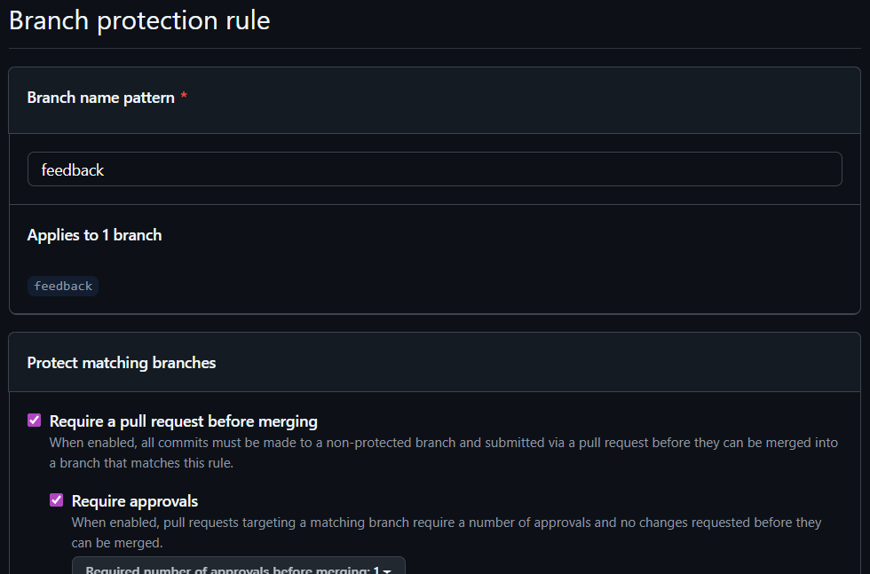
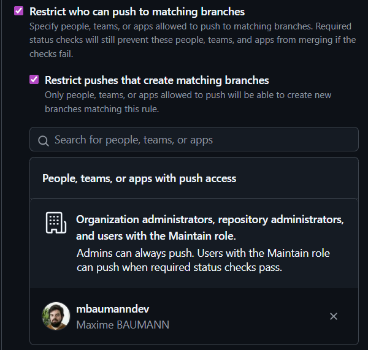
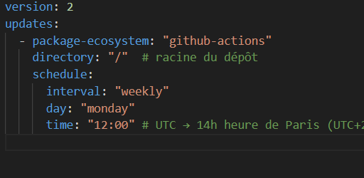
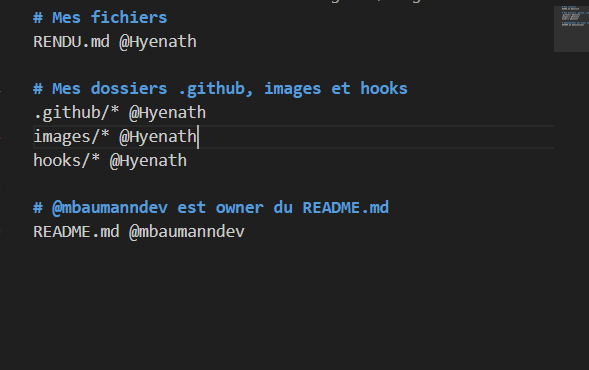
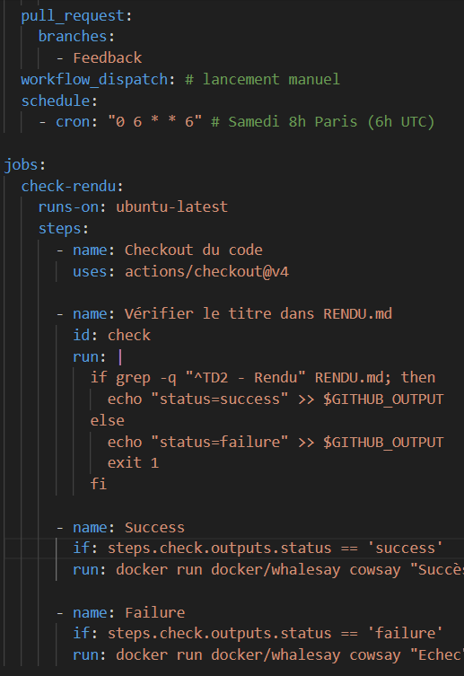

Git LFS (Large File Stockage) = extension Git gérant les frois fichies : images, vidéos...

Ne stocke pas ces fichiers dans Git, utilise des pointeurs dans le dépôt et garde les fichiers ailleurs pour ne pas prendre trop de place.

-> Commandes :

$ git clone git@github.com:UpjvIutAmiens/td2-d-couverte-de-github-Hyenath.git

$ git branch

$ cd td2-d-couverte-de-github-Hyenath/

$ touch RENDU.md

$ mkdir images

$ git add RENDU.md

$ git add images

$ git commit -m "Rendu et images"

$ git branch -r

$ git push origin main

$ git lfs install

$ git lfs version

$ git lfs track "*.png"

$ git add .gitattributes

$ git commit -m "Git LFS pour le dossier image"

---------

$ mkdir hooks

$ rm -rf .git/hooks 
//-r : dossier et -f : force

$ ln -s ../hooks .git/hooks 
//ln => link; -s : symbolique;

chmod +x hooks/pre-commit
chmod +x hooks/pre-generate-msg
//rendre les hooks exécutable

//![...] => Texte alternatif

---------

// "-" Sert à créer une liste de puce en md

touch .github/pull_request_template.md

mkdir -r ISSUE_TEMPLATE
touch bug_report.md

git checkout -b bug-report-remplate

git add .github/pull_request_template.md
git commit -m "Ajout du template de Pull Request"
git push origin bug-report-template

git fetch origin
git checkout main
git merge bug-report-template

--------------

mkdir -r workflows
touch workflows/check.yml

git add .\.github\/workflows/check.yml
git commit -m "Ajout de la vérif de titre"
git push origin main

--------

touch .github/dependabot.yml

git add .github/dependabot.yml
git commit -m "Ajout configuration Dependabot pour GitHub Actions"
git push origin main

--------------

touch .github/CODEOWNERS

git add .github/CODEOWNERS
git commit -m "Ajout fichier CODEOWNERS"
git push origin main

-------------

--------------

git add .
git commit -m "Check modif docker"
git push origin main

git tag le-tag
git push origin le-tag
